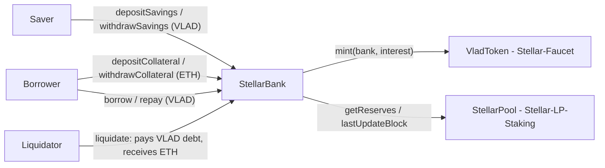

# Stellar Bank — VLAD savings + ETH-collateralized credit (Sepolia)

Stellar Bank is a small "credit distribution" bank on Ethereum Sepolia. It does two things:

1. **Savings.** Users deposit VLAD and earn simple interest. The interest is **minted** in VLAD by the bank
   (the bank holds `MINTER_ROLE` on the VLAD token).
2. **Credit lines.** Users deposit ETH as collateral and borrow VLAD against it. Borrow interest is **not** minted:
   it is paid by the borrower on repayment and stays in the bank as extra lending liquidity.

> Stellar is a personal Web3 portfolio suite on Ethereum Sepolia. It is a portfolio brand and has nothing to do
> with the Stellar (XLM) network.

## Architecture



| Contract | Repo | Role here |
| --- | --- | --- |
| `StellarBank` | this repo (`src/StellarBank.sol`) | savings, collateral, loans, liquidations |
| `VladToken` ($VLAD, "Vladimir", 18 decimals) | Stellar-Faucet | savings asset, loan asset; mints savings interest to the bank |
| `StellarPool` (ETH/VLAD constant-product AMM) | Stellar-LP-Staking | spot price source (`getReserves`, `lastUpdateBlock`) |

This repo only uses the interfaces `src/interfaces/IVladToken.sol` and `src/interfaces/IStellarPool.sol`;
tests run against `test/mocks/MockVlad.sol` and `test/mocks/MockPool.sol`.

## Parameters

| Name | Value | Meaning |
| --- | --- | --- |
| `savingsRateBps` | 1000 (10% APR) at deploy, owner can change | simple interest paid to savers |
| `borrowRateBps` | 2000 (20% APR) at deploy, owner can change | simple interest charged to borrowers |
| `LTV_BPS` | 5000 (50%) | maximum debt as a share of collateral value when borrowing or withdrawing collateral |
| `LIQ_THRESHOLD_BPS` | 7500 (75%) | share of collateral value that counts towards the health factor |
| `LIQ_BONUS_BPS` | 1000 (10%) | extra ETH the liquidator receives on top of the repaid debt |
| `YEAR` | 365 days | interest period |

## Formulas

All amounts are in wei (18 decimals). `bps` = basis points, 10,000 bps = 100%.

**Price.** `ethPrice = vladReserve * 1e18 / ethReserve` — VLAD per 1 ETH, scaled by 1e18. The call reverts with
`NoLiquidityInPool` if either reserve is zero.

**Price = AMM spot from Stellar-LP-Staking with a same-block guard; demo oracle, production would use Chainlink/TWAP.**
Every price-dependent action (`borrow`, `liquidate`, and `withdrawCollateral` while the caller has debt) first
checks `pool.lastUpdateBlock() < block.number`. If the pool's reserves changed in the current block, the action
reverts with `SameBlockPriceUpdate`. This blocks the classic single-transaction attack (swap to move the price,
borrow or liquidate at the moved price, swap back). It does not protect against a price that is held at a
manipulated level for one or more full blocks, which is why this is a demo oracle.

**Interest (savings and loans).** Simple interest since the user's last accrual:
`interest = principal * rateBps * (now - lastAccrued) / (YEAR * 10_000)`. Accrual happens on every action of that
user and folds the interest into `principal`. Savings interest is minted to the bank; loan interest is only added
to the debt.

**Collateral value, borrow limit, health factor.**

```
collateralValue = collateralEth * ethPrice / 1e18                       (in VLAD)
maxBorrow       = collateralValue * LTV_BPS / 10_000                    (50% of collateral value)
healthFactor    = collateralValue * LIQ_THRESHOLD_BPS * 1e18 / (debt * 10_000)
                  (type(uint256).max when debt == 0; liquidatable when healthFactor < 1e18)
```

`borrow(amount)` requires `debt + amount <= maxBorrow` and `amount <= VLAD balance of the bank`.
`withdrawCollateral(eth)` requires that after the withdrawal `debt <= maxBorrow` of the remaining collateral.

## Liquidation math

When `healthFactor < 1e18`, anyone can call `liquidate(borrower)`:

1. The liquidator pays the borrower's **full** debt in VLAD (`transferFrom`, so the liquidator approves first).
2. The liquidator receives `seize = min(collateralEth, debt * (10_000 + LIQ_BONUS_BPS) / 10_000 * 1e18 / ethPrice)`
   ETH, which is the debt plus a 10% bonus, converted to ETH at the spot price and capped at the collateral.
3. The debt is set to zero. Any ETH left over (`collateralEth - seize`) stays with the borrower, who can withdraw it.

Worked example (the same numbers as `test_LiquidateSeizesWithBonusAndLeavesRemainder`):

| Step | Value |
| --- | --- |
| Collateral | 1 ETH |
| Price at borrow time | 2,000 VLAD per ETH, so `maxBorrow` = 1,000 VLAD |
| Debt | 1,000 VLAD; health factor = 2,000 × 0.75 / 1,000 = 1.5 |
| Liquidation price | health factor < 1 when price < 1,000 / (1 × 0.75) = 1,333.33 VLAD per ETH |
| Price drops to | 1,200 VLAD per ETH; health factor = 1,200 × 0.75 / 1,000 = 0.9 |
| Liquidator pays | 1,000 VLAD |
| Liquidator receives | 1,000 × 1.10 / 1,200 = 0.916666… ETH (worth 1,100 VLAD) |
| Borrower keeps | 1 − 0.916666… = 0.083333… ETH |

## Known simplifications (demo scope)

- The oracle is the AMM spot price with only a same-block guard (see above).
- Savers carry liquidity risk: `withdrawSavings` reverts with `InsufficientLiquidity` while their VLAD is lent out.
- A rate change through `setRates` also applies to the time since each user's last accrual.
- If collateral is worth less than 110% of the debt, the liquidator still repays the full debt and receives all
  collateral; there is no bad-debt socialisation.
- Savings interest requires the bank to keep `MINTER_ROLE` on VLAD; the VLAD admin can revoke it.

## Web app

**Live: https://vladimirradev.github.io/Stellar-Bank/**

The frontend in `web/` is React 19 + Vite 8 + wagmi 3 + viem 2 + Tailwind CSS 4, built from the shared Stellar
scaffold (`web/SCAFFOLD.md`). `web/src/shell/` (navigation, wallet button, transaction button, formatting) is
identical in all six Stellar apps; the bank page itself is in `web/src/app/`. MetaMask (injected wallet) only,
public Sepolia RPCs, no backend.

- **Header stats:** ETH price in VLAD (AMM spot with the same-block guard), free VLAD liquidity, savings APR,
  borrow APR and the number of borrowers.
- **Save:** your savings balance ticks up every 100 ms in the browser with the contract's simple-interest formula.
  Deposit is Approve then Deposit; Withdraw has a MAX that sends `type(uint256).max` (everything, including interest).
- **Borrow (credit line):** collateral and its VLAD value, live debt, max borrow, credit-used bar, a colour-coded
  health-factor gauge (green from 1.5, amber from 1 to 1.5, red below 1, ∞ without debt), the liquidation price, and
  Add ETH / Withdraw / Borrow / Repay with a preview of the health factor after the action.
- **Liquidate:** the first 50 borrowers with collateral, debt and health factor (one multicall), sortable by health
  factor. Positions below 1 can be liquidated in place, with the VLAD you pay and the ETH you receive shown first.
- Custom errors (for example `SameBlockPriceUpdate`, `ExceedsLtv`) are decoded into readable sentences before the
  wallet opens.
- While `web/src/config/addresses.ts` holds zero addresses, on-chain reads are switched off and the page shows a
  "not deployed yet" banner.

```shell
forge build                      # the web app reads ABIs from out/
cd web
npm install
npm run sync-abi                 # out/ -> src/abi/*.ts
npm run dev                      # http://localhost:5173/Stellar-Bank/
```

`.github/workflows/pages.yml` builds `web/` and publishes it to GitHub Pages on every push to `main`.

## Deployed addresses (Sepolia, chain id 11155111)

| Contract | Address | Deploy tx |
|---|---|---|
| StellarBank | [`0x4Dd37833521B458E72139eF77a17Ff9A50FC1588`](https://eth-sepolia.blockscout.com/address/0x4Dd37833521B458E72139eF77a17Ff9A50FC1588) | [`0xf3b6492f…07e25f`](https://eth-sepolia.blockscout.com/tx/0xf3b6492f2b33113ebfdd26b1c3d9438fb6631fb0f22334f404a1358b7907e25f) |
| VladToken ($VLAD, from Stellar-Faucet) | [`0x49ba857d553ef219B144b200F41acaf8CB6768E9`](https://eth-sepolia.blockscout.com/address/0x49ba857d553ef219B144b200F41acaf8CB6768E9) | [`0x3b24505f…f9f5d3`](https://eth-sepolia.blockscout.com/tx/0x3b24505f6310f9ee43a43465e923814519b6e66197674b612910591aa0f9f5d3) |
| StellarPool (price source, from Stellar-LP-Staking) | [`0xAC08AA11850cf015160A93DAD746CA480407b7Ae`](https://eth-sepolia.blockscout.com/address/0xAC08AA11850cf015160A93DAD746CA480407b7Ae) | see Stellar-LP-Staking |

`MINTER_ROLE` on VLAD was granted to the bank in tx
[`0x0b68dd31…1b7528`](https://eth-sepolia.blockscout.com/tx/0x0b68dd31b40af632bb4ad9cb9b8005a50138b8dad45140b0aab19a0a871b7528).
StellarBank is verified on Sourcify (exact match) and Blockscout. Full details (blocks, gas, verification,
post-deploy checks) are in [`deployments/sepolia.json`](deployments/sepolia.json).

## Develop

```shell
forge build
forge test -vvv
forge fmt --check
```

## Deploy

The deploy script sends exactly two transactions from the deployer:

1. create `StellarBank(VLAD_TOKEN, STELLAR_POOL, 1000, 2000)` (10% savings APR, 20% borrow APR);
2. `VladToken.grantRole(MINTER_ROLE, bank)`, so the bank can mint savings interest.

The deployer key must hold `DEFAULT_ADMIN_ROLE` on VLAD. It is read from the `PRIVATE_KEY` environment variable
and lives in an env file outside the repo (`.env*` is git-ignored anyway). The script refuses to run when
`VLAD_TOKEN` or `STELLAR_POOL` has no contract code.

```shell
set -a; source /path/to/deployer.env; set +a
VLAD_TOKEN=0x49ba857d553ef219B144b200F41acaf8CB6768E9 STELLAR_POOL=<pool> \
forge script script/Deploy.s.sol \
  --rpc-url https://ethereum-sepolia-rpc.publicnode.com \
  --broadcast --slow --skip-simulation \
  --priority-gas-price 10000000 --with-gas-price 1000000000 -vvv
```

- `--skip-simulation`: Sepolia's current fork prices contract creation about 6.5 times above forge's local
  Cancun simulation. Without the flag, forge sets each gas limit to the local estimate × 1.3 and the creation runs
  out of gas. With it, forge asks the Sepolia node for a gas estimate right before each send.
- `--slow`: the deployer account carries an EIP-7702 delegation, so the node accepts only one unconfirmed
  transaction at a time. `--slow` waits for each receipt before sending the next transaction.
- If a send is still rejected with "in-flight transaction limit reached for delegated accounts", wait about 20
  seconds and rerun the same command with `--resume`; it sends only the transactions that are still missing.

## Smoke tests (2026-10-09)

End-to-end run on Ethereum Sepolia on 2026-10-09 from the deployer `0xEb0243ea72CB24eFb7128Ee7aca314C080b600c4` (an EIP-7702 delegated EOA), with `smoke.sh` (19 steps across the whole suite, one transaction at a time, each waiting for its receipt). After every transaction the script compared balances, reserves and events at the transaction's block with the block before it; "ok" means every such assertion passed. Step numbers are the suite-wide order. Rows for this repo (step 7 is the VLAD approval for the bank):

| Step | Function | Result | Tx (Blockscout) | Gas used |
|---|---|---|---|---|
| 7 | `vlad.approve(bank, max)` | ok | [`0x5276df90…565ee2`](https://eth-sepolia.blockscout.com/tx/0x5276df90ad2466ba152274337d98342dd99b796561603ef64528843843565ee2) | 128628 |
| 8 | `bank.depositSavings(500e18)` | ok | [`0xdaa30c59…084102`](https://eth-sepolia.blockscout.com/tx/0xdaa30c595c012b0aa7ba5021e7da498d1ec5e4f73bb4c58d73172f3e3a084102) | 373716 |
| 9 | `bank.depositCollateral() 0.0005 ETH` | ok | [`0xcc7e8281…d8b027`](https://eth-sepolia.blockscout.com/tx/0xcc7e82810051b86c460b9bfb28b4d41492e4d9b65e15a5e1665b9f0bf3d8b027) | 466087 |
| 10 | `bank.borrow(20e18)` | ok | [`0x066bf6b6…23062b`](https://eth-sepolia.blockscout.com/tx/0x066bf6b6c411ee7d413220fd6dea650becc785dfb2f2c9f4a713655c4123062b) | 288072 |
| 11 | `bank.repay(max)` | ok | [`0xb6ee38e7…282b8c`](https://eth-sepolia.blockscout.com/tx/0xb6ee38e7bd9aa2bbe061060885b1e5a7d73a7f17ddbdd36ecdc2bca736282b8c) | 72696 |
| 12 | `bank.withdrawCollateral(full)` | ok | [`0x71425f3c…603e3a`](https://eth-sepolia.blockscout.com/tx/0x71425f3c03e2a4654ef66d93d8117159aaffc9e9e7fb94f8bc6f229432603e3a) | 57316 |
| 13 | `bank.withdrawSavings(max)` | ok | [`0xec3a1b72…44502e`](https://eth-sepolia.blockscout.com/tx/0xec3a1b7273c602049eca2ec15ea80027ade37490976df1097e8105260244502e) | 87050 |

- Step 10 borrow: 20 VLAD against 0.0005 ETH at 99008.928055830738494975 VLAD/ETH; maxBorrow 24.752232013957684623; health factor 1.856417401046826346
- Step 11 repay: repaid 20.000003044140030441 VLAD (borrow interest 0.000003044140030441 VLAD over 24 s)
- Step 12 collateral: withdrew 0.0005 ETH collateral
- Step 13 savings: withdrew 500.000228310502283105 VLAD; InterestAccrued = 0.000228310502283105 VLAD (228310502283105 wei) over 144 s at 1000 bps

## Part of the Stellar suite

| App | Repository | Live site |
|---|---|---|
| Faucet ($VLAD token) | [Stellar-Faucet](https://github.com/VladimirRadev/Stellar-Faucet) | https://vladimirradev.github.io/Stellar-Faucet/ |
| Swap & LP Staking | [Stellar-LP-Staking](https://github.com/VladimirRadev/Stellar-LP-Staking) | https://vladimirradev.github.io/Stellar-LP-Staking/ |
| Bank | **[Stellar-Bank](https://github.com/VladimirRadev/Stellar-Bank)** (this repo) | https://vladimirradev.github.io/Stellar-Bank/ |
| Store | [Stellar-Store](https://github.com/VladimirRadev/Stellar-Store) | https://vladimirradev.github.io/Stellar-Store/ |
| Arena + Arcade | [Stellar-Arena](https://github.com/VladimirRadev/Stellar-Arena) | https://vladimirradev.github.io/Stellar-Arena/ |
| Stellargon (prediction market) | [Stellargon](https://github.com/VladimirRadev/Stellargon) | https://vladimirradev.github.io/Stellargon/ |

Stellar is a personal portfolio brand, unrelated to the Stellar (XLM) network.

## License

MIT
