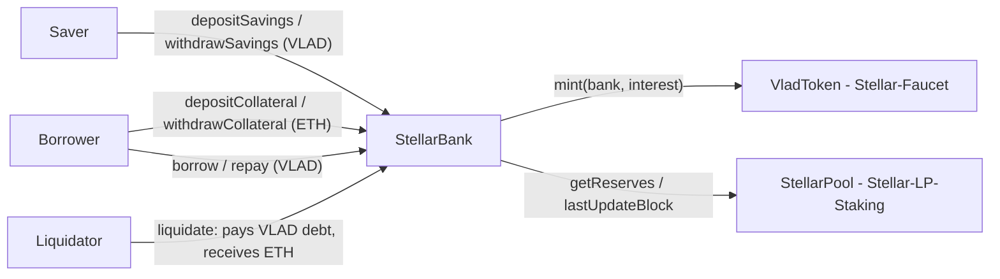

# Stellar Bank — VLAD savings + ETH-collateralized credit (Sepolia)

Stellar Bank is a small "credit distribution" bank on Ethereum Sepolia. It does two things:

1. **Savings.** Users deposit VLAD and earn simple interest. The interest is **minted** in VLAD by the bank
   (the bank holds `MINTER_ROLE` on the VLAD token).
2. **Credit lines.** Users deposit ETH as collateral and borrow VLAD against it. Borrow interest is **not** minted:
   it is paid by the borrower on repayment and stays in the bank as extra lending liquidity.

> Stellar is a personal Web3 portfolio suite on Ethereum Sepolia. It is a portfolio brand and has nothing to do
> with the Stellar (XLM) network.

## Architecture



| Contract | Repo | Role here |
| --- | --- | --- |
| `StellarBank` | this repo (`src/StellarBank.sol`) | savings, collateral, loans, liquidations |
| `VladToken` ($VLAD, "Vladimir", 18 decimals) | Stellar-Faucet | savings asset, loan asset; mints savings interest to the bank |
| `StellarPool` (ETH/VLAD constant-product AMM) | Stellar-LP-Staking | spot price source (`getReserves`, `lastUpdateBlock`) |

This repo only uses the interfaces `src/interfaces/IVladToken.sol` and `src/interfaces/IStellarPool.sol`;
tests run against `test/mocks/MockVlad.sol` and `test/mocks/MockPool.sol`.

## Parameters

| Name | Value | Meaning |
| --- | --- | --- |
| `savingsRateBps` | 1000 (10% APR) at deploy, owner can change | simple interest paid to savers |
| `borrowRateBps` | 2000 (20% APR) at deploy, owner can change | simple interest charged to borrowers |
| `LTV_BPS` | 5000 (50%) | maximum debt as a share of collateral value when borrowing or withdrawing collateral |
| `LIQ_THRESHOLD_BPS` | 7500 (75%) | share of collateral value that counts towards the health factor |
| `LIQ_BONUS_BPS` | 1000 (10%) | extra ETH the liquidator receives on top of the repaid debt |
| `YEAR` | 365 days | interest period |

## Formulas

All amounts are in wei (18 decimals). `bps` = basis points, 10,000 bps = 100%.

**Price.** `ethPrice = vladReserve * 1e18 / ethReserve` — VLAD per 1 ETH, scaled by 1e18. The call reverts with
`NoLiquidityInPool` if either reserve is zero.

**Price = AMM spot from Stellar-LP-Staking with a same-block guard; demo oracle, production would use Chainlink/TWAP.**
Every price-dependent action (`borrow`, `liquidate`, and `withdrawCollateral` while the caller has debt) first
checks `pool.lastUpdateBlock() < block.number`. If the pool's reserves changed in the current block, the action
reverts with `SameBlockPriceUpdate`. This blocks the classic single-transaction attack (swap to move the price,
borrow or liquidate at the moved price, swap back). It does not protect against a price that is held at a
manipulated level for one or more full blocks, which is why this is a demo oracle.

**Interest (savings and loans).** Simple interest since the user's last accrual:
`interest = principal * rateBps * (now - lastAccrued) / (YEAR * 10_000)`. Accrual happens on every action of that
user and folds the interest into `principal`. Savings interest is minted to the bank; loan interest is only added
to the debt.

**Collateral value, borrow limit, health factor.**

```
collateralValue = collateralEth * ethPrice / 1e18                       (in VLAD)
maxBorrow       = collateralValue * LTV_BPS / 10_000                    (50% of collateral value)
healthFactor    = collateralValue * LIQ_THRESHOLD_BPS * 1e18 / (debt * 10_000)
                  (type(uint256).max when debt == 0; liquidatable when healthFactor < 1e18)
```

`borrow(amount)` requires `debt + amount <= maxBorrow` and `amount <= VLAD balance of the bank`.
`withdrawCollateral(eth)` requires that after the withdrawal `debt <= maxBorrow` of the remaining collateral.

## Liquidation math

When `healthFactor < 1e18`, anyone can call `liquidate(borrower)`:

1. The liquidator pays the borrower's **full** debt in VLAD (`transferFrom`, so the liquidator approves first).
2. The liquidator receives `seize = min(collateralEth, debt * (10_000 + LIQ_BONUS_BPS) / 10_000 * 1e18 / ethPrice)`
   ETH, which is the debt plus a 10% bonus, converted to ETH at the spot price and capped at the collateral.
3. The debt is set to zero. Any ETH left over (`collateralEth - seize`) stays with the borrower, who can withdraw it.

Worked example (the same numbers as `test_LiquidateSeizesWithBonusAndLeavesRemainder`):

| Step | Value |
| --- | --- |
| Collateral | 1 ETH |
| Price at borrow time | 2,000 VLAD per ETH, so `maxBorrow` = 1,000 VLAD |
| Debt | 1,000 VLAD; health factor = 2,000 × 0.75 / 1,000 = 1.5 |
| Liquidation price | health factor < 1 when price < 1,000 / (1 × 0.75) = 1,333.33 VLAD per ETH |
| Price drops to | 1,200 VLAD per ETH; health factor = 1,200 × 0.75 / 1,000 = 0.9 |
| Liquidator pays | 1,000 VLAD |
| Liquidator receives | 1,000 × 1.10 / 1,200 = 0.916666… ETH (worth 1,100 VLAD) |
| Borrower keeps | 1 − 0.916666… = 0.083333… ETH |

## Known simplifications (demo scope)

- The oracle is the AMM spot price with only a same-block guard (see above).
- Savers carry liquidity risk: `withdrawSavings` reverts with `InsufficientLiquidity` while their VLAD is lent out.
- A rate change through `setRates` also applies to the time since each user's last accrual.
- If collateral is worth less than 110% of the debt, the liquidator still repays the full debt and receives all
  collateral; there is no bad-debt socialisation.
- Savings interest requires the bank to keep `MINTER_ROLE` on VLAD; the VLAD admin can revoke it.

## Deployed addresses (Sepolia)

| Contract | Address |
| --- | --- |
| StellarBank | TODO |
| VladToken (Stellar-Faucet) | TODO |
| StellarPool (Stellar-LP-Staking) | TODO |

## Develop

```shell
forge build
forge test -vvv
forge fmt --check
```

Deploy (2 transactions: create the bank, grant it `MINTER_ROLE`). The deployer key must hold `DEFAULT_ADMIN_ROLE`
on VLAD. Keep secrets in an untracked `.env` file; `.env*` is git-ignored.

```shell
export PRIVATE_KEY=0x...      # VLAD admin key
export VLAD_TOKEN=0x...       # VladToken from Stellar-Faucet
export STELLAR_POOL=0x...     # StellarPool from Stellar-LP-Staking
forge script script/Deploy.s.sol --rpc-url "$SEPOLIA_RPC_URL" --broadcast
```

## Part of the Stellar suite

| Repo | Site |
| --- | --- |
| [Stellar-Faucet](https://github.com/VladimirRadev/Stellar-Faucet) | https://vladimirradev.github.io/Stellar-Faucet/ |
| [Stellar-LP-Staking](https://github.com/VladimirRadev/Stellar-LP-Staking) | https://vladimirradev.github.io/Stellar-LP-Staking/ |
| [Stellar-Bank](https://github.com/VladimirRadev/Stellar-Bank) | https://vladimirradev.github.io/Stellar-Bank/ |
| [Stellar-Store](https://github.com/VladimirRadev/Stellar-Store) | https://vladimirradev.github.io/Stellar-Store/ |
| [Stellar-Arena](https://github.com/VladimirRadev/Stellar-Arena) | https://vladimirradev.github.io/Stellar-Arena/ |

## License

MIT
